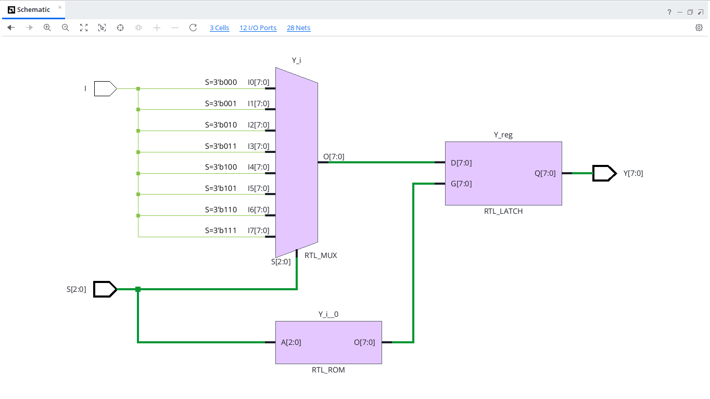
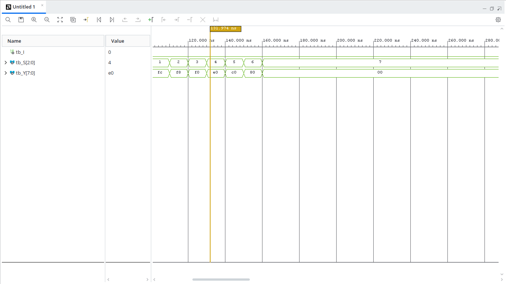

# 1x8 Demultiplexer (VHDL)

## Overview
A $1 \times 8$ Demultiplexer (DEMUX) takes a single data input line (`I`) and routes it to one of eight output lines (`Y[7:0]`), selected by a 3-bit control input (`S[2:0]`). All unselected output lines remain at logic `'0'`.

---

## Entity Specification

### Inputs
* `I` : `STD_LOGIC` — Single bit data input line
* `S` : `STD_LOGIC_VECTOR(2 downto 0)` — 3-bit select lines ($2^3 = 8$ outputs)

### Outputs
* `Y` : `STD_LOGIC_VECTOR(7 downto 0)` — 8-bit output vector

---

## Truth Table

| Select ($S_2 S_1 S_0$) | Input ($I$) | $Y_7$ | $Y_6$ | $Y_5$ | $Y_4$ | $Y_3$ | $Y_2$ | $Y_1$ | $Y_0$ |
| :---: | :---: | :---: | :---: | :---: | :---: | :---: | :---: | :---: | :---: |
| `000` | $I$ | 0 | 0 | 0 | 0 | 0 | 0 | 0 | **$I$** |
| `001` | $I$ | 0 | 0 | 0 | 0 | 0 | 0 | **$I$** | 0 |
| `010` | $I$ | 0 | 0 | 0 | 0 | 0 | **$I$** | 0 | 0 |
| `011` | $I$ | 0 | 0 | 0 | 0 | **$I$** | 0 | 0 | 0 |
| `100` | $I$ | 0 | 0 | 0 | **$I$** | 0 | 0 | 0 | 0 |
| `101` | $I$ | 0 | 0 | **$I$** | 0 | 0 | 0 | 0 | 0 |
| `110` | $I$ | 0 | **$I$** | 0 | 0 | 0 | 0 | 0 | 0 |
| `111` | $I$ | **$I$** | 0 | 0 | 0 | 0 | 0 | 0 | 0 |

---

## RTL Schematic

---

## Behavioral Simulation

---

## How to Run Simulation

1. Open **Xilinx Vivado**.
2. Add `demux1x8.vhd` as a **Design Source**.
3. Add `tb_demux1x8.vhd` as a **Simulation Source**.
4. Run **Behavioral Simulation** to verify the channel routing across all select combinations (`000` to `111`).