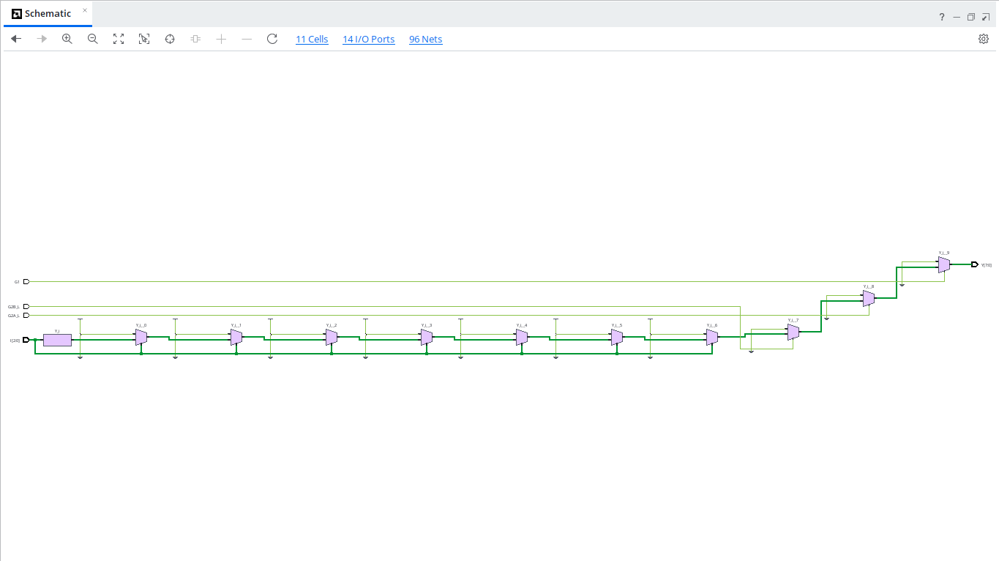
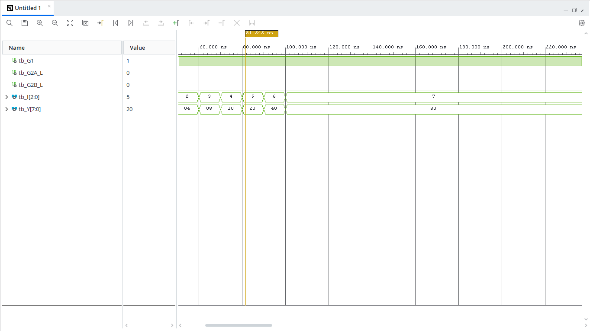

# 3x8 Decoder with Enable Logic (VHDL)

## Overview
A $3 \times 8$ Decoder decodes a 3-bit binary input code (`I[2:0]`) into an 8-bit one-hot output signal (`Y[7:0]`). This implementation includes a standard 3-pin enable scheme: one active-high enable (`G1`) and two active-low enables (`G2A_L`, `G2B_L`). The output is active only when $G1 = '1'$, $G2A\_L = '0'$, and $G2B\_L = '0'$.

---

## Entity Specification

### Inputs
* `G1` : `STD_LOGIC` — Active-high enable input
* `G2A_L` : `STD_LOGIC` — Active-low enable input A
* `G2B_L` : `STD_LOGIC` — Active-low enable input B
* `I` : `STD_LOGIC_VECTOR(2 downto 0)` — 3-bit binary input address

### Outputs
* `Y` : `STD_LOGIC_VECTOR(7 downto 0)` — 8-bit decoded active-high output vector

---

## Truth Table

| Enable Conditions | Input (`I[2:0]`) | Outputs (`Y[7:0]`) | Selected Line |
| :---: | :---: | :---: | :---: |
| Disabled ($G1=0 \text{ or } G2A\_L=1 \text{ or } G2B\_L=1$) | `XXX` | `00000000` | None |
| Enabled ($G1=1, G2A\_L=0, G2B\_L=0$) | `000` | `00000001` | $Y_0$ |
| Enabled ($G1=1, G2A\_L=0, G2B\_L=0$) | `001` | `00000010` | $Y_1$ |
| Enabled ($G1=1, G2A\_L=0, G2B\_L=0$) | `010` | `00000100` | $Y_2$ |
| Enabled ($G1=1, G2A\_L=0, G2B\_L=0$) | `011` | `00001000` | $Y_3$ |
| Enabled ($G1=1, G2A\_L=0, G2B\_L=0$) | `100` | `00010000` | $Y_4$ |
| Enabled ($G1=1, G2A\_L=0, G2B\_L=0$) | `101` | `00100000` | $Y_5$ |
| Enabled ($G1=1, G2A\_L=0, G2B\_L=0$) | `110` | `01000000` | $Y_6$ |
| Enabled ($G1=1, G2A\_L=0, G2B\_L=0$) | `111` | `10000000` | $Y_7$ |

---

## RTL Schematic

---

## Behavioral Simulation

---

## How to Run Simulation

1. Open **Xilinx Vivado**.
2. Add `decoder3x8.vhd` as a **Design Source**.
3. Add `tb_decoder3x8.vhd` as a **Simulation Source**.
4. Run **Behavioral Simulation** to verify enable conditions and full 3-to-8 line decoding.