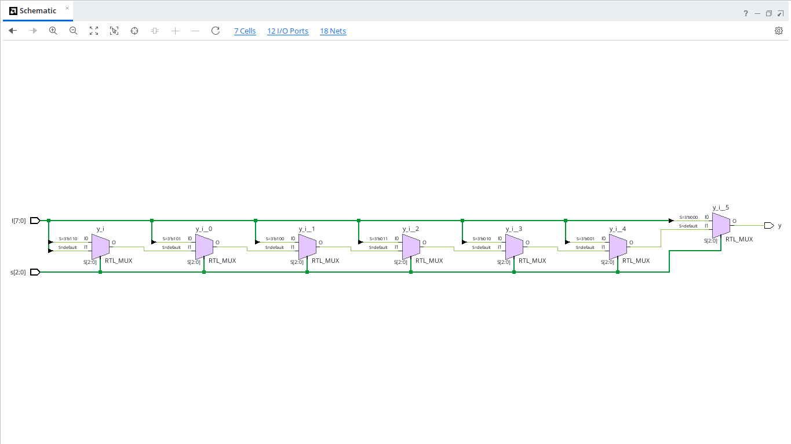
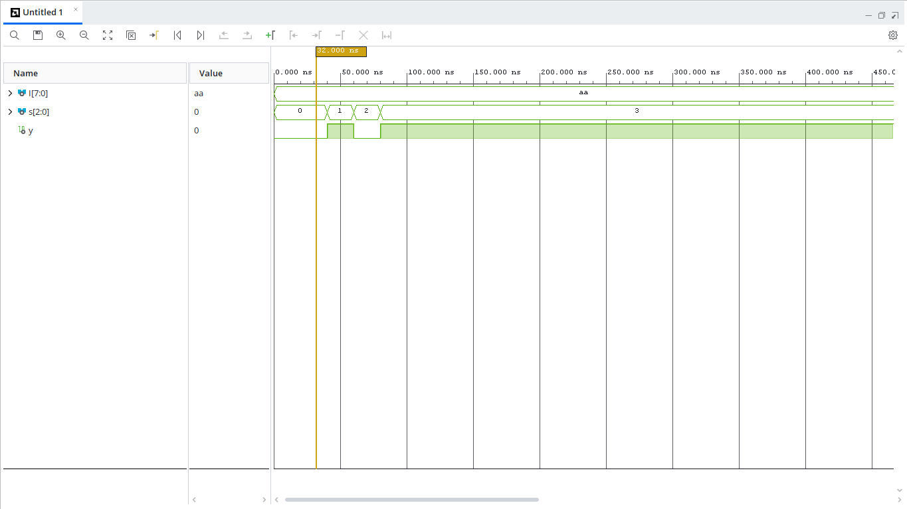

# 8x1 Multiplexer (VHDL)

## Overview
An 8-to-1 Multiplexer routes one of 8 data input lines (`I[7:0]`) to a single output line (`y`), controlled by a 3-bit select signal (`s[2:0]`).

## Entity Specification
- **Inputs:**
  - `I` : `STD_LOGIC_VECTOR(7 downto 0)` (Data Inputs)
  - `s` : `STD_LOGIC_VECTOR(2 downto 0)` (Select Lines)
- **Outputs:**
  - `y` : `STD_LOGIC` (Selected Data Output)

## RTL Schematic

## Behavioral Simulation
