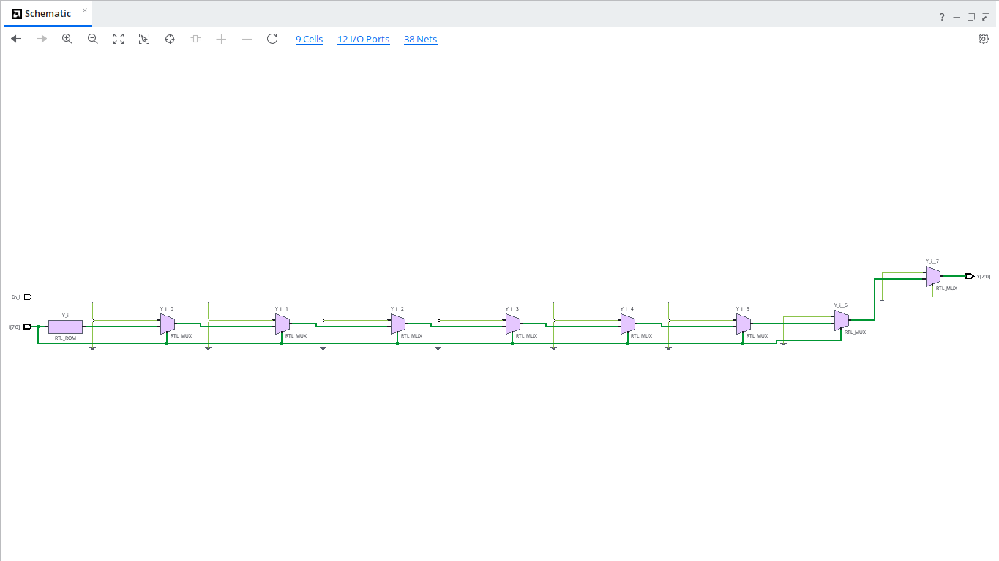
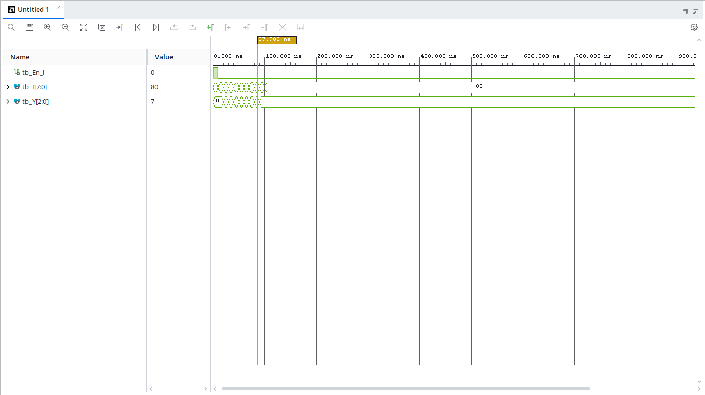

# 8x3 Encoder with Enable (VHDL)

## Overview
An $8 \times 3$ Encoder converts active high input signals from 8 individual data lines (`I[7:0]`) into a 3-bit binary code output (`Y[2:0]`). This design includes an **active-low enable line (`En_l`)**. When `En_l` is high (`'1'`), the encoder is disabled and forces the output vector to `"000"`.

---

## Entity Specification

### Inputs
* `En_l` : `STD_LOGIC` — Active-low enable signal (`'0'` = Enabled, `'1'` = Disabled)
* `I` : `STD_LOGIC_VECTOR(7 downto 0)` — 8-bit one-hot input vector

### Outputs
* `Y` : `STD_LOGIC_VECTOR(2 downto 0)` — 3-bit encoded binary output

---

## Truth Table

| Enable (`En_l`) | Inputs (`I[7:0]`) | Output (`Y[2:0]`) | Encoded Value |
| :---: | :---: | :---: | :---: |
| `1` | `XXXXXXXX` | `000` | Disabled |
| `0` | `00000001` | `000` | 0 |
| `0` | `00000010` | `001` | 1 |
| `0` | `00000100` | `010` | 2 |
| `0` | `00001000` | `011` | 3 |
| `0` | `00010000` | `100` | 4 |
| `0` | `00100000` | `101` | 5 |
| `0` | `01000000` | `110` | 6 |
| `0` | `10000000` | `111` | 7 |
| `0` | *Others / Invalid* | `000` | Default / Fallback |

---

## RTL Schematic

---

## Behavioral Simulation

---

## How to Run Simulation

1. Open **Xilinx Vivado**.
2. Add `encoder8x3.vhd` as a **Design Source**.
3. Add `tb_encoder8x3.vhd` as a **Simulation Source**.
4. Run **Behavioral Simulation** to verify the binary encoding across all 8 one-hot input states and check disable logic.