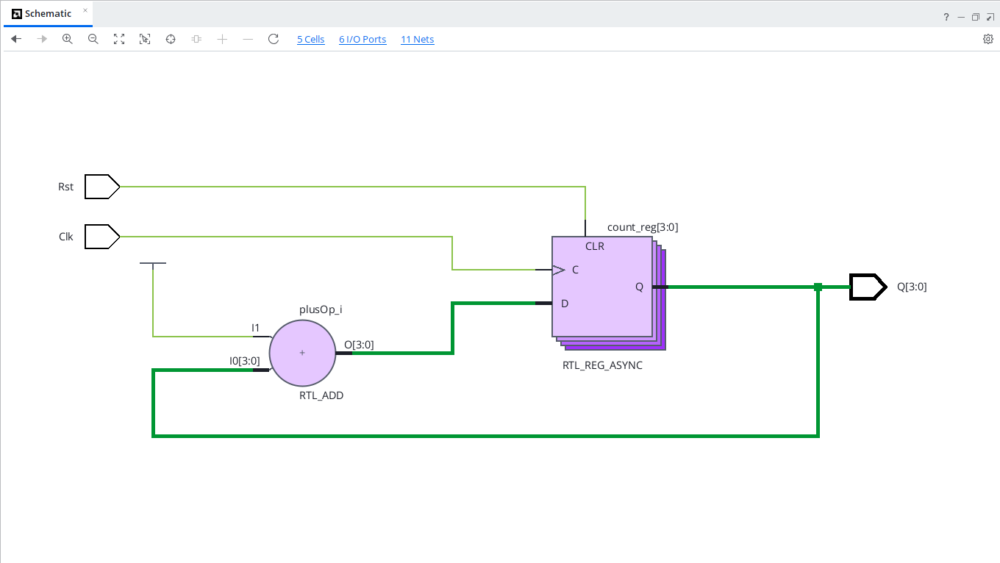
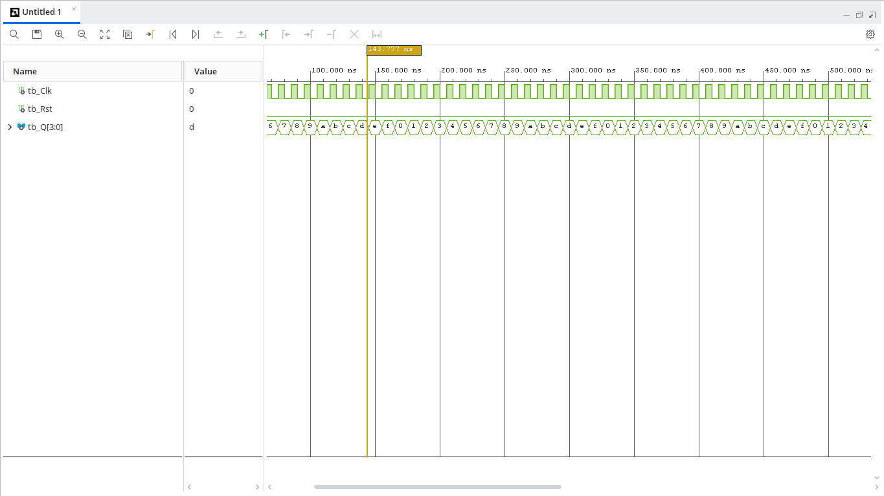

# 4-bit Synchronous Up Counter (VHDL)

## Overview
A 4-bit synchronous up-counter that increments its binary value on every rising clock edge from `0000` ($0_{10}$) up to `1111` ($15_{10}$) before rolling over back to `0000`. It features an active-high reset (`Rst`).

---

## Entity Specification

### Inputs
* `Clk` : `STD_LOGIC` — Clock input signal
* `Rst` : `STD_LOGIC` — Asynchronous active-high reset signal

### Outputs
* `Q`   : `STD_LOGIC_VECTOR(3 downto 0)` — 4-bit binary count output

---

## State Sequence Table

| Reset (`Rst`) | Clock (`Clk`) | Binary Output (`Q[3:0]`) | Decimal Value |
| :---: | :---: | :---: | :---: |
| `1` | X | `0000` | 0 |
| `0` | $\uparrow$ | `0001` | 1 |
| `0` | $\uparrow$ | `0010` | 2 |
| ... | $\uparrow$ | ... | ... |
| `0` | $\uparrow$ | `1111` | 15 |
| `0` | $\uparrow$ | `0000` | Rollover to 0 |

---

## RTL Schematic

---

## Behavioral Simulation
