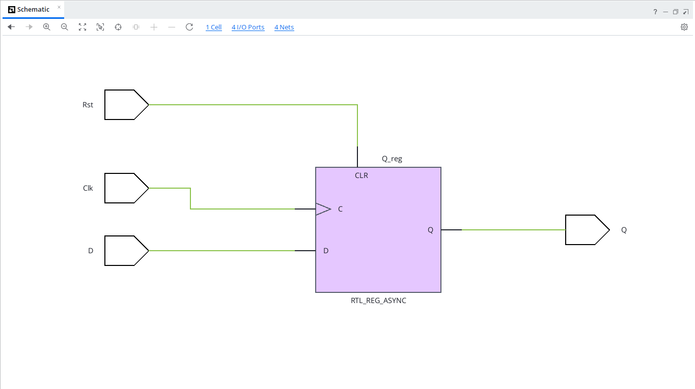
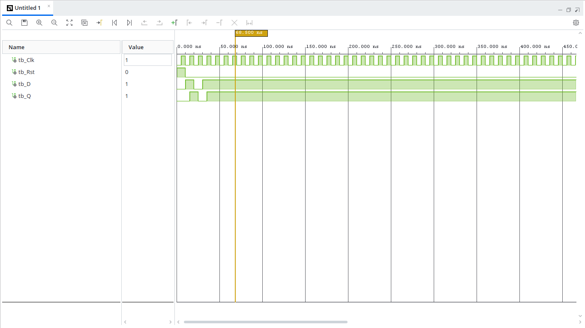

# D Flip-Flop with Asynchronous Reset (VHDL)

## Overview
A D Flip-Flop (Data or Delay Flip-Flop) is a fundamental sequential logic element that captures the value of the input `D` on the rising edge of the clock signal (`Clk`) and transfers it to the output `Q`. This design includes an asynchronous active-high reset (`Rst`).

---

## Entity Specification

### Inputs
* `Clk` : `STD_LOGIC` — Clock input signal
* `Rst` : `STD_LOGIC` — Asynchronous active-high reset signal
* `D`   : `STD_LOGIC` — Data input signal

### Outputs
* `Q`   : `STD_LOGIC` — Output state

---

## Truth Table

| Reset (`Rst`) | Clock (`Clk`) | Data (`D`) | Output ($Q_{next}$) | State Description |
| :---: | :---: | :---: | :---: | :---: |
| `1` | X | X | `0` | Asynchronous Reset |
| `0` | $\uparrow$ | `0` | `0` | Reset / Load '0' |
| `0` | $\uparrow$ | `1` | `1` | Set / Load '1' |
| `0` | `0` / `1` | X | $Q_{prev}$ | Hold state |

---

## RTL Schematic

---

## Behavioral Simulation
