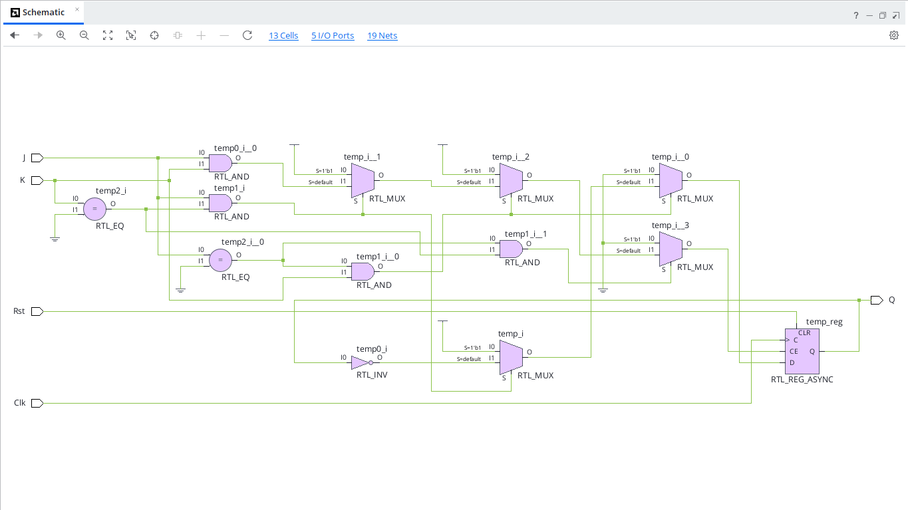
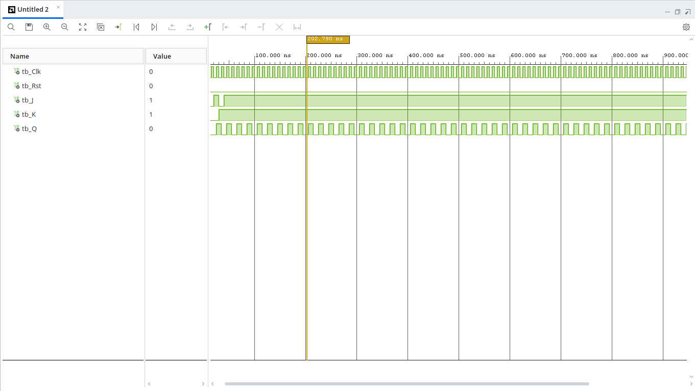

# JK Flip-Flop with Reset (VHDL)

## Overview
A JK Flip-Flop is a versatile sequential circuit that eliminates the invalid condition found in basic SR Flip-Flops. When both inputs $J=1$ and $K=1$, the output toggles on every rising clock edge.

---

## Entity Specification

### Inputs
* `Clk` : `STD_LOGIC` — Clock input signal
* `Rst` : `STD_LOGIC` — Asynchronous active-high reset signal
* `J`   : `STD_LOGIC` — Set control input
* `K`   : `STD_LOGIC` — Reset control input

### Outputs
* `Q`   : `STD_LOGIC` — Output state

---

## Truth Table

| Reset (`Rst`) | Clock (`Clk`) | $J$ | $K$ | Output ($Q_{next}$) | Operation |
| :---: | :---: | :---: | :---: | :---: | :---: |
| `1` | X | X | X | `0` | Reset State |
| `0` | $\uparrow$ | `0` | `0` | $Q_{prev}$ | No Change (Hold) |
| `0` | $\uparrow$ | `0` | `1` | `0` | Reset |
| `0` | $\uparrow$ | `1` | `0` | `1` | Set |
| `0` | $\uparrow$ | `1` | `1` | $\overline{Q_{prev}}$ | Toggle |

---

## RTL Schematic

---

## Behavioral Simulation
