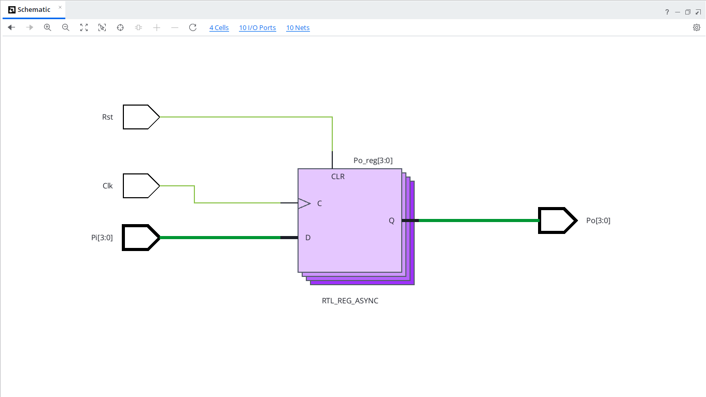
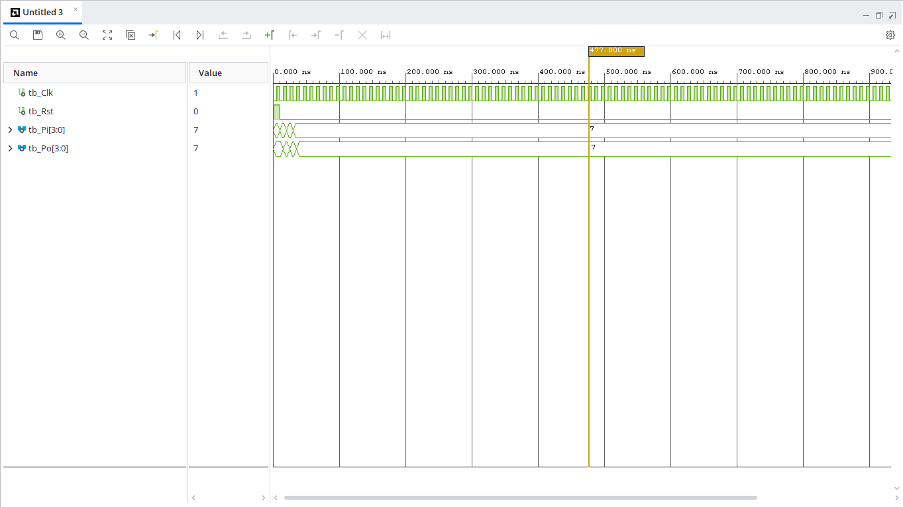

# 4-bit PIPO Shift Register (VHDL)

## Overview
A Parallel-In Parallel-Out (PIPO) shift register loads all 4 bits of input data (`Pi[3:0]`) simultaneously on a single rising clock edge and presents them immediately on the parallel output vector (`Po[3:0]`).

---

## Entity Specification

### Inputs
* `Clk` : `STD_LOGIC` — Clock input signal
* `Rst` : `STD_LOGIC` — Asynchronous active-high reset signal
* `Pi`  : `STD_LOGIC_VECTOR(3 downto 0)` — 4-bit parallel data input

### Outputs
* `Po`  : `STD_LOGIC_VECTOR(3 downto 0)` — 4-bit parallel data output

---

## Operation Truth Table

| Reset (`Rst`) | Clock (`Clk`) | Parallel Input (`Pi[3:0]`) | Parallel Output ($Po_{next}$) |
| :---: | :---: | :---: | :---: |
| `1` | X | `XXXX` | `0000` |
| `0` | $\uparrow$ | $D_3 D_2 D_1 D_0$ | $D_3 D_2 D_1 D_0$ |

---

## RTL Schematic

---

## Behavioral Simulation
