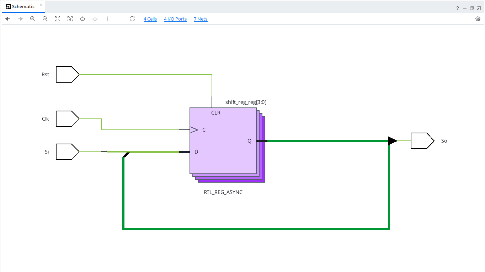
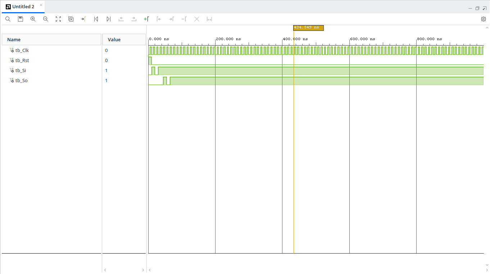

# 4-bit SISO Shift Register (VHDL)

## Overview
A Serial-In Serial-Out (SISO) shift register receives data sequentially one bit at a time on input `Si` and shifts it through four internal flip-flop stages on each rising clock edge. The output bit exits sequentially from `So`.

---

## Entity Specification

### Inputs
* `Clk` : `STD_LOGIC` — Clock input signal
* `Rst` : `STD_LOGIC` — Asynchronous active-high reset signal
* `Si`  : `STD_LOGIC` — Serial data input line

### Outputs
* `So`  : `STD_LOGIC` — Serial data output line

---

## Shifting Operation

On each rising clock edge:
$$\text{Shift Vector} \leftarrow \text{Shift Vector}(2 \text{ downto } 0) \ \ \& \ \ Si$$
$$\text{Output } So \leftarrow \text{Shift Vector}(3)$$

---

## RTL Schematic

---

## Behavioral Simulation
