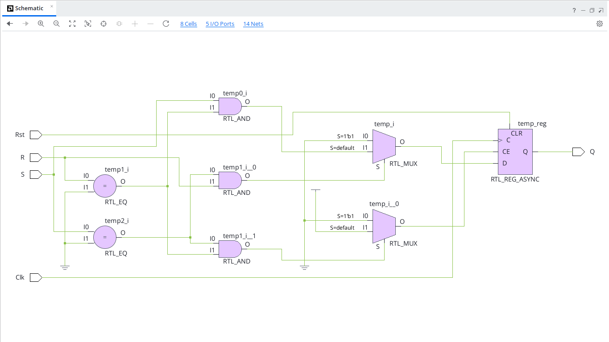
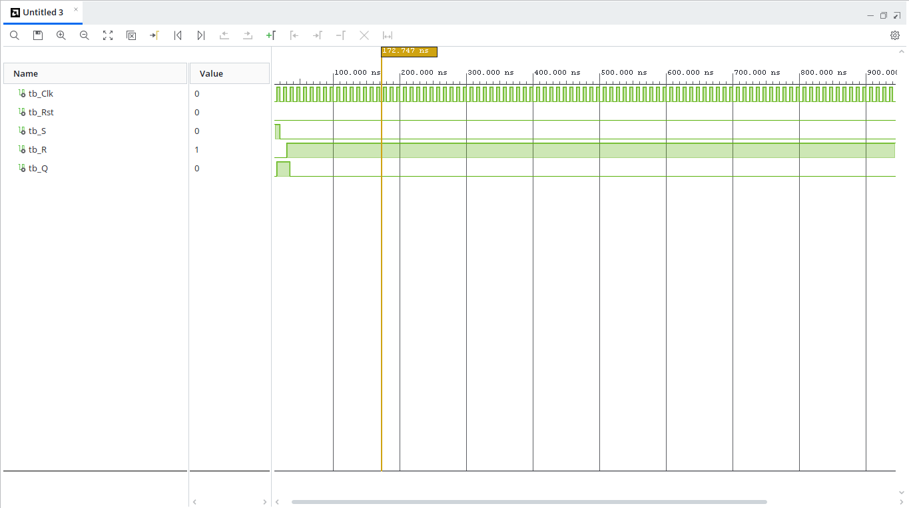

# SR Flip-Flop with Reset (VHDL)

## Overview
An SR (Set-Reset) Flip-Flop is a basic bistable sequential circuit. The output sets to `'1'` when $S=1, R=0$ and resets to `'0'` when $S=0, R=1$. The condition where both $S=1$ and $R=1$ is invalid and handled in VHDL by driving the output to `'X'`.

---

## Entity Specification

### Inputs
* `Clk` : `STD_LOGIC` — Clock input signal
* `Rst` : `STD_LOGIC` — Asynchronous active-high reset signal
* `S`   : `STD_LOGIC` — Set input line
* `R`   : `STD_LOGIC` — Reset input line

### Outputs
* `Q`   : `STD_LOGIC` — Output state

---

## Truth Table

| Reset (`Rst`) | Clock (`Clk`) | $S$ | $R$ | Output ($Q_{next}$) | Operation |
| :---: | :---: | :---: | :---: | :---: | :---: |
| `1` | X | X | X | `0` | Reset State |
| `0` | $\uparrow$ | `0` | `0` | $Q_{prev}$ | No Change (Hold) |
| `0` | $\uparrow$ | `0` | `1` | `0` | Reset |
| `0` | $\uparrow$ | `1` | `0` | `1` | Set |
| `0` | $\uparrow$ | `1` | `1` | `X` | Invalid Condition |

---

## RTL Schematic

---

## Behavioral Simulation
