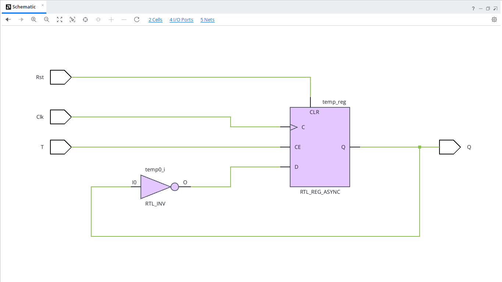
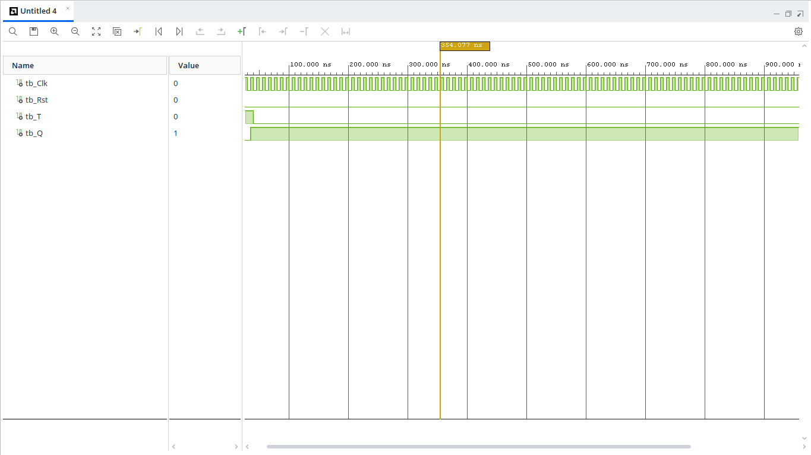

# T Flip-Flop with Reset (VHDL)

## Overview
A T (Toggle) Flip-Flop changes its output state on every rising clock edge whenever the input line `T` is held high (`'1'`). If `T = '0'`, the output retains its previous state ($Q_{prev}$).

---

## Entity Specification

### Inputs
* `Clk` : `STD_LOGIC` — Clock input signal
* `Rst` : `STD_LOGIC` — Asynchronous active-high reset signal
* `T`   : `STD_LOGIC` — Toggle control signal

### Outputs
* `Q`   : `STD_LOGIC` — Output state

---

## Truth Table

| Reset (`Rst`) | Clock (`Clk`) | Toggle (`T`) | Output ($Q_{next}$) | Operation |
| :---: | :---: | :---: | :---: | :---: |
| `1` | X | X | `0` | Reset State |
| `0` | $\uparrow$ | `0` | $Q_{prev}$ | Hold State |
| `0` | $\uparrow$ | `1` | $\overline{Q_{prev}}$ | Toggle State |

---

## RTL Schematic

---

## Behavioral Simulation
